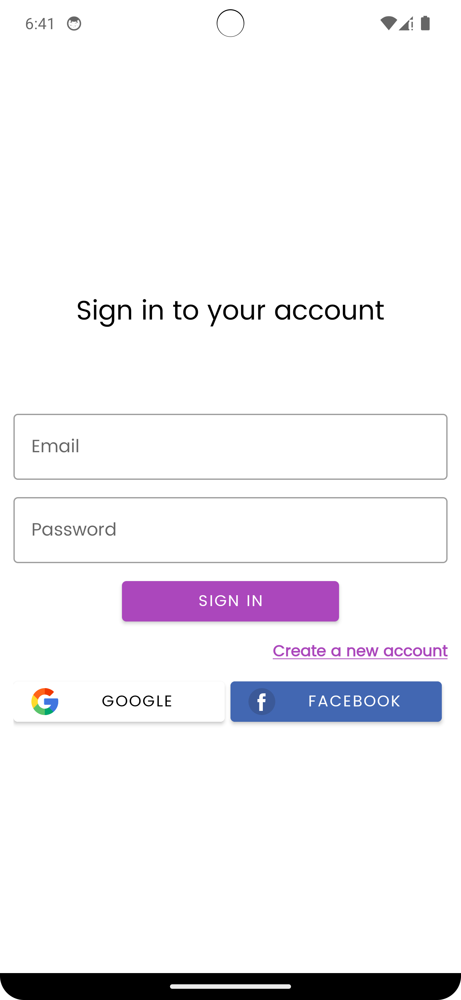
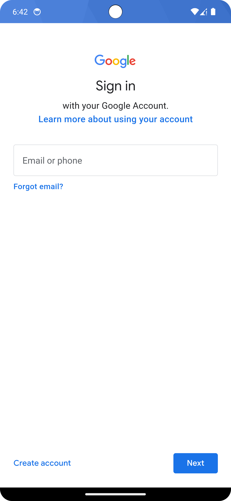

# QuizApp

QuizApp is an Android application that offers a fun and engaging way for users to test their knowledge across various topics through quizzes. Users can register, log in, and start participating in quizzes to challenge themselves and learn new things. The app is designed to provide an enjoyable and educational experience for users of all ages.

## Features

### User Authentication
- **Registration**: Users can create an account using their email and password.
- **Login**: Registered users can log in to access the app's features.
- **Google Sign-In**: Users can also log in using their Google account for convenience.

### Quiz Categories
- **Diverse Topics**: Quizoholic offers a wide range of quiz categories, including Mathematics, Science, History, Computers, Gadgets, and Sports.
- **Customizable**: Users can select their preferred quiz categories to tailor their quiz experience.

### Quiz Taking
- **Multiple-Choice Questions**: Quizzes consist of multiple-choice questions that challenge users' knowledge in their selected categories.
- **Interactive Interface**: The app provides an intuitive and user-friendly interface for answering questions.

### Results
- **Score Tracking**: After completing a quiz, users can view their score and see which questions they answered correctly and incorrectly.
- **Performance Analysis**: Quiz results help users identify areas for improvement and track their progress over time.

### User Profile
- **Personalized Profile**: Each user has a profile page where they can view their username, total quizzes taken, best score, and total score.
- **Profile Picture**: Users can upload a profile picture to personalize their profile.

## Technologies Used

### Development Tools
- **Kotlin**: The app is developed using Kotlin, a modern programming language for Android development.
- **Android Studio**: The official IDE for Android app development, used for coding, testing, and debugging.

### Backend Services
- **Firebase**: Firebase is used for backend services, including user authentication and data storage.
- **Firebase Authentication**: Provides secure user authentication with email/password and Google Sign-In options.
- **Firestore Database**: Stores quiz data and user information in a scalable and flexible NoSQL database.

### Libraries and Frameworks
- **Volley**: Volley is used for making HTTP requests to fetch quiz data from an external API.
- **Picasso**: Picasso is an image loading library used for loading user profile pictures.

## Getting Started

To get started with QuizApp, follow these steps:

1. **Clone the Repository**: Clone the repository to your local machine using `git clone <repository-url>`.
2. **Set Up Firebase**: Set up a Firebase project and add your `google-services.json` file to the `app` directory.
3. **Build and Run**: Open the project in Android Studio, build the app, and run it on an Android device or emulator.

## Screenshots

